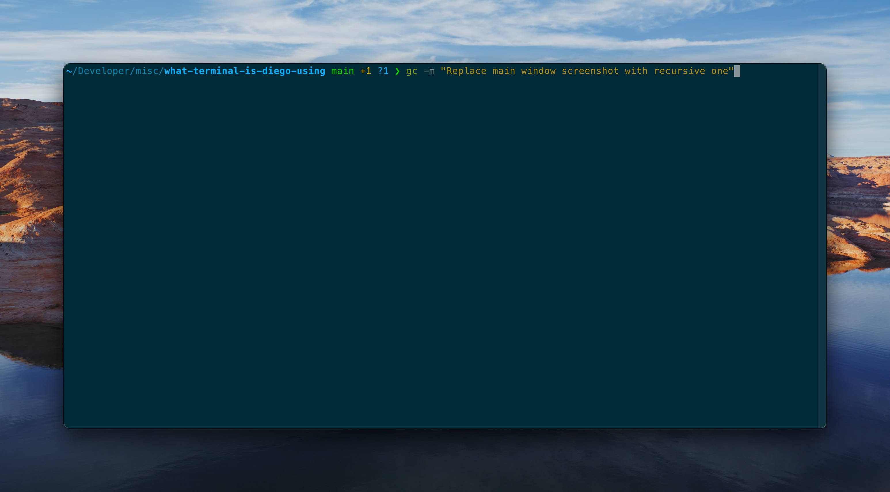
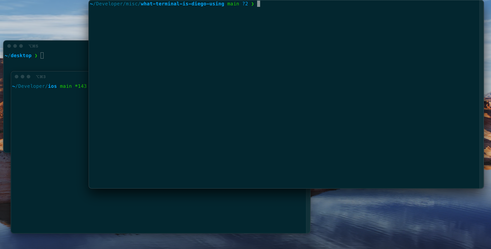

# What terminal is Diego using

I use [iTerm](https://iterm2.com/) as a replacement for the default Mac terminal, and install it via homebrew `brew install --cask iterm2`. I configure it as such:

* `Minimal` UI: iTerm > Preferences > Appearance > General > Minimal
* [Solarised dark theme, patched](https://raw.githubusercontent.com/mbadolato/iTerm2-Color-Schemes/master/schemes/Solarized%20Dark%20-%20Patched.itermcolors). Double click on the downloaded file, and then iTerm > Preferences > Profiles > Colors > Load presets > select the theme
* Natural syntax selection: the default way terminals treat word selection doesn't sit well with my habits, so I enable the "natural" one: iTerm > Preferences > Profiles > Keys > Key mappings > Presets... > Natural Text Editing > Apply (and replace) 
* [Oh my zsh](https://github.com/ohmyzsh/ohmyzsh), for configuring zsh: `sh -c "$(curl -fsSL https://raw.githubusercontent.com/robbyrussell/oh-my-zsh/master/tools/install.sh)"`
* [PowerLevel10k](https://github.com/romkatv/powerlevel10k?tab=readme-ov-file#oh-my-zsh) as a prompt theme: `git clone https://github.com/romkatv/powerlevel10k.git $ZSH_CUSTOM/themes/powerlevel10k`. After installing it, I swap the theme in `~/.zshrc` with `ZSH_THEME="powerlevel10k/powerlevel10k"`. When opening a new iTerm window the configuration wizard will start, but if it doesn't it can be triggered by `p10k configure`. I mostly use the standard/recommended config
* I use a few zsh plugins (add them as a new line in `~/.zshrc` > `plugins=()`). Here's my current ones: `git`, `zsh-syntax-highlighting`, `zsh-autosuggestions`, `zsh-history-substring-search`, `z`, `sudo`, `macos`, `you-should-use`

## Windows

I use a mix of a main, central window where I do most things, and a few floating accessory ones dedicated to specific tasks (eg one for the iOS repo at the place I work at, one for running a docker image, and so on)

### Main window

* iTerm > Preferences > Profiles > Default > Window > 130 coloumns, 30 rows
* iTerm > Preferences > Profiles > Default > Window > Style > Top of screen
* iTerm > Preferences > Profiles > Default > Window > Force this profile to open in a new window
* iTerm > Preferences > Profiles > Default > Window > Space > Space 1

### Accessories, an example

* iTerm > Preferences > Profiles > iOS > General > Shortcut key > `⌃⌘i`
* iTerm > Preferences > Profiles > iOS > General > Directory > something like `~/Developer/ios`
* iTerm > Preferences > Profiles > iOS > Window > 120 coloumns, 25 rows
* iTerm > Preferences > Profiles > Default > Window > Style > Normal
* iTerm > Preferences > Profiles > Default > Window > Force this profile to open in a new window
* iTerm > Preferences > Profiles > Default > Window > Custom window title > eg `iOS`